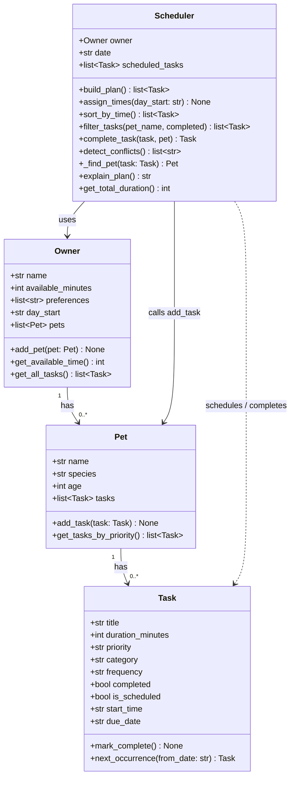

# PawPal+ — Final Class Diagram

Paste the Mermaid code below into [mermaid.live](https://mermaid.live) to render and export as PNG.

## Changes from initial UML (Phase 1)

| What changed | Why |
|---|---|
| `Task` gained `start_time`, `due_date`, `next_occurrence()` | Needed for time-based sorting and recurring task automation |
| `Owner` gained `day_start` | Scheduler needs a reference clock to assign `HH:MM` start times |
| `Scheduler` gained 6 new methods | Sorting, filtering, recurrence, conflict detection, and pet lookup were added as the algorithm layer grew |
| `Scheduler → Pet` (calls `add_task`) | `complete_task()` adds the next recurrence directly to the pet — this relationship was not in the original design |
